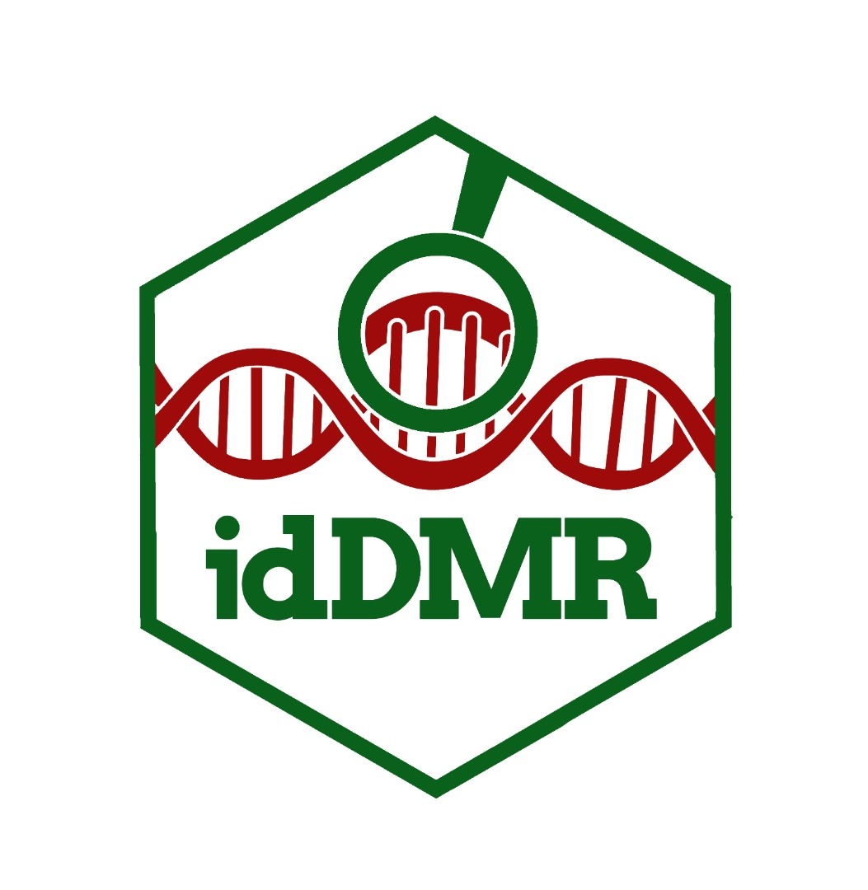

# idDMR Package  
idDMR - Identify Differentially Methylated Regions for Microarray Data 🧬

## Installation

You can install the release version from CRAN

``` r
install.packages("idDMR")
```

and the development version from GitHub

``` r
source("https://install-github.me//DanielAlhassan/idDMR")
# or
# install.packages("devtools")
devtools::install_github("danielalhassan/idDMR") 
```

## Overview
