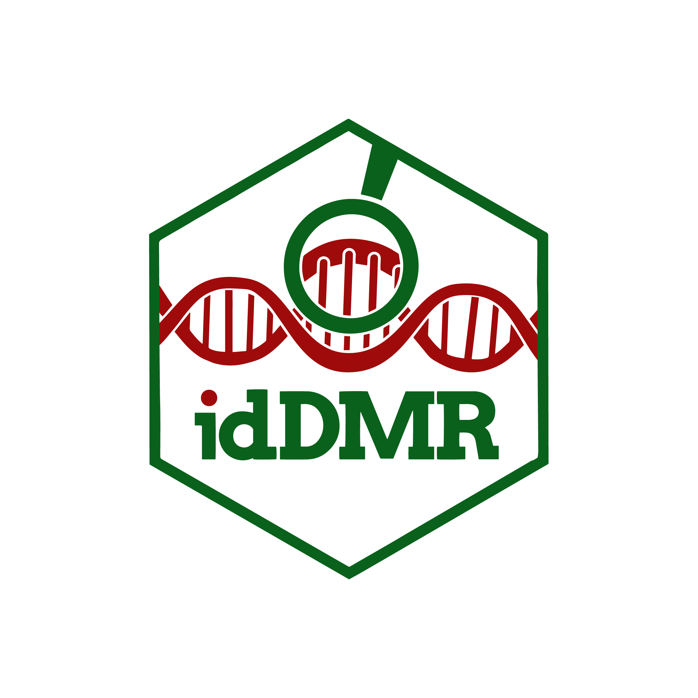

# idDMR Package  
idDMR - Identify Differentially Methylated Regions for Microarray Data 🧬

<!-- badges: start -->
[](https://github.com/DanielAlhassan/idDMR/actions/workflows/r.yml)
[](commits/develop)
[](https://www.gnu.org/licenses/gpl-3.0.en.html)

<!-- badges: end -->


## Documentation


## Installation
<!--
You can install the release version from CRAN

``` r
install.packages("idDMR", dependencies=TRUE)
```

and the development version from GitHub
-->
``` r
install.packages("devtools")
devtools::install_github("DanielAlhassan/idDMR") 
```

## Usage
To use the **idDMR** package, start by loading dependencies which will install (where necessary) and load all dependent packages:

```r
library(idDMR)

load_dependencies()
```

To run CpG site-level test (or determine differentially methylated loci), use the function `cpgsite.annotate()`
```r
myannotation <- cpgsite.annotate(datatype = "array", mval, what = "M", arraytype = "450K",
                                 analysis.type = "differential", design = design_mat,
                                 coef = 2, fdr = 0.05)
```

Next, use `aadmr()` function to identify differentially methylated regions. 
```r
aadmr = aaDMR(myannotation, g = 1000,  min.cpgs = 2)

#extract the DMResults and output as a dataframe
aadmr_df <- arrange(data.frame(extractRanges(aadmr, genome = "hg19")), seqnames)

```

## Acknowledgments
We would like to immensely thank all authors and contributors to the DMRcate R/Biconductor package - their work served as a major foundation for this package we made.

## Citation
When you use idDMR package, please cite the following:
```r
@Article{,
  author = {Timothy J Peters and Michael J Buckley and Aaron L Statham and Ruth Pidsley and Katherine Samaras and Reginald V Lord and Susan J Clark and Peter L Molloy},
  title = {De novo identification of differentially methylated regions in the human genome},
  journal = {Epigenetics & Chromatin},
  year = {2015},
  volume = {8},
  pages = {6},
  url = {http://www.epigeneticsandchromatin.com/content/8/1/6},
}

@Article{,
  author = {Timothy J Peters and Michael J Buckley and {Yunshun Chen} and Gordon K Smyth and Christopher C Goodnow and Susan J Clark},
  title = {Calling differentially methylated regions from whole genome bisulphite sequencing with DMRcate},
  journal = {Nucleic Acids Research},
  year = {2021},
  volume = {49},
  issue = {19},
  url = {https://academic.oup.com/nar/article/49/19/e109/6329576},
}

@Manual{,
    title = {idDMR: Methylation Analysis Methods for Illumina Microarray Data},
    author = {Daniel Alhassan and Gayla Olbricht and Akim Adekpedjou and Ebenezer Agbozo},
    year = {2022},
    note = {R package version 0.5.0},
    url = {https://github.com/DanielAlhassan/idDMR}
  }
```


## License
This package is free and open source software, licensed under GPL-3.
